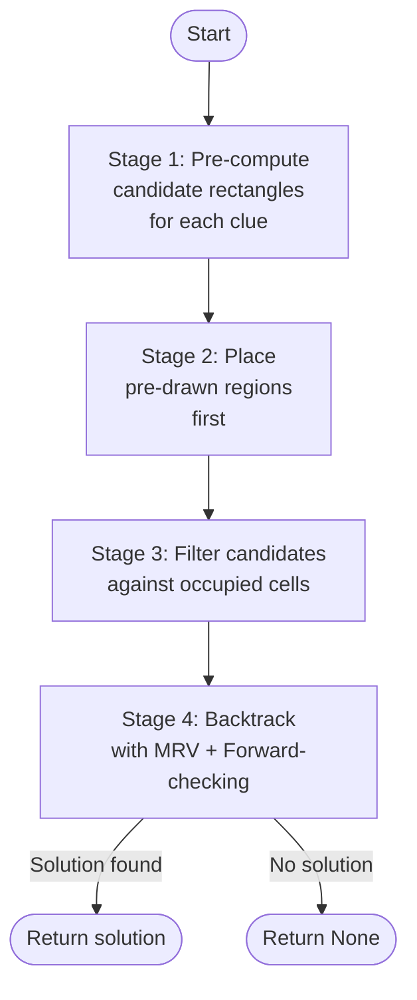
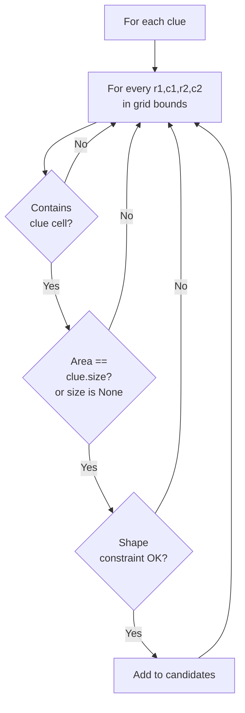
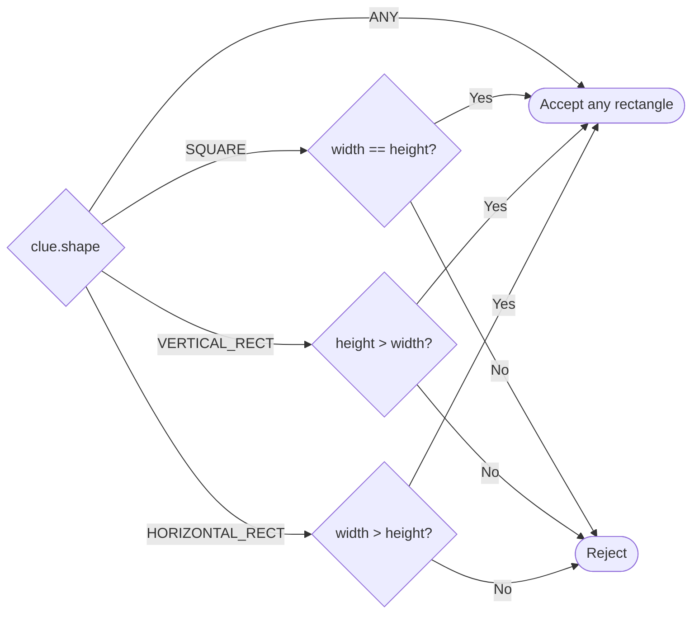
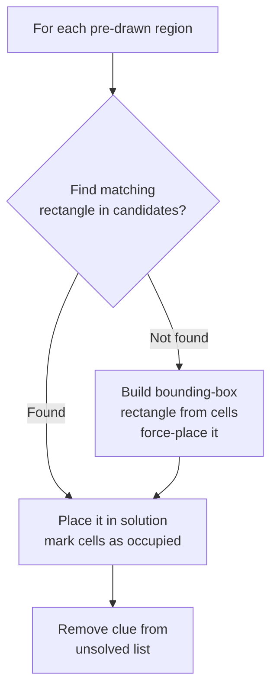
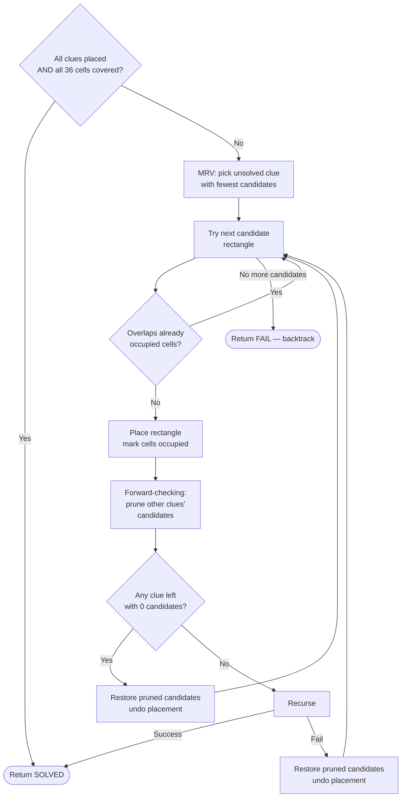
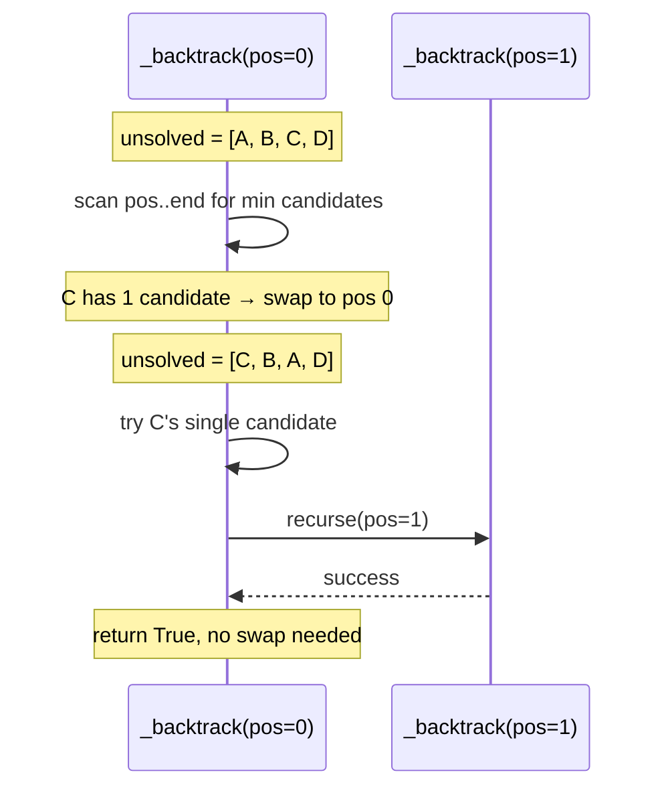
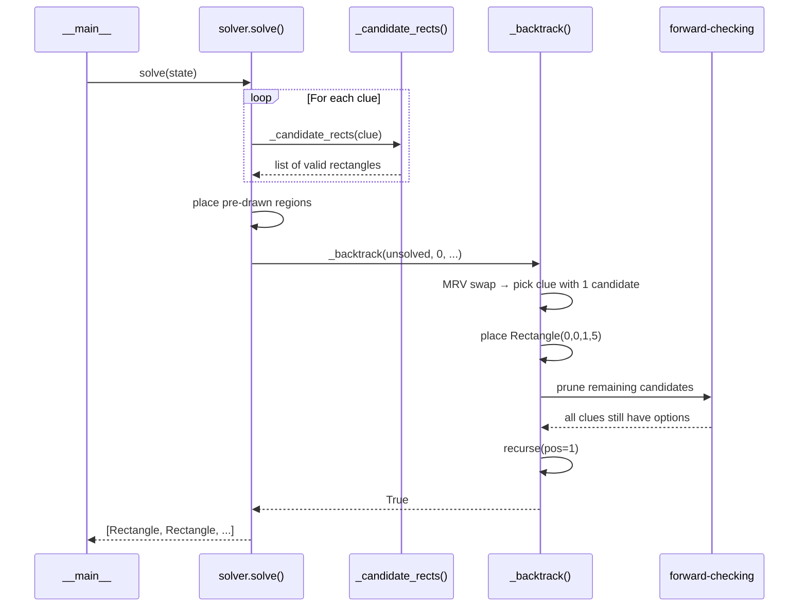

# Patches — Algorithm

**Source:** `linkedin_games/patches/solver.py`

## Approach: CSP + Forward-checking + MRV

Patches is modelled as a **Constraint Satisfaction Problem (CSP)**:

| Component | Description |
|-----------|-------------|
| Variables | One rectangle per clue |
| Domain | All geometrically valid rectangles for that clue (pre-computed) |
| Constraints | No two rectangles overlap; together they tile all 36 cells exactly once |

The solver runs in four stages:



---

## Stage 1: Candidate rectangle generation

Before any search, every valid rectangle for every clue is enumerated. A rectangle `(r1, c1, r2, c2)` is valid for a clue if:

1. It **contains** the clue cell `(clue.row, clue.col)`.
2. It **fits** within the 6×6 grid.
3. Its **area** equals `clue.size` (if specified).
4. Its **shape** satisfies `clue.shape`.



### Shape constraint decision



---

## Stage 2: Pre-drawn region placement

Some cells may already be highlighted (pre-drawn by a previous partial solve).
These are placed before the search begins — they consume cells and reduce the
effective search space immediately.



---

## Stage 3: Backtracking with MRV + Forward-checking

This is the core search. At each recursive step:

1. **MRV** — select the unsolved clue with the fewest remaining candidate rectangles.
2. **Try** each candidate in turn.
3. **Forward-check** — after placing a rectangle, remove from every other clue's candidate list any rectangle that would overlap the newly occupied cells.  If any clue's list becomes empty, abort this branch immediately.
4. **Recurse** or **backtrack**.



---

## MRV swap mechanism

The solver maintains `unsolved` as a mutable list. At position `pos`, it finds the index `best_pos ≥ pos` with the smallest candidate count, swaps it to `pos`, and solves it next. After backtracking, the swap is reversed:



---

## Forward-checking in detail

After placing rectangle `R` for clue `i`:

```mermaid
flowchart TD
    A[occupied += R.cells()] --> B[For each remaining\nunsolved clue j]
    B --> C["new_j = [r for r in candidates[j]\nif not r.cells() & occupied]"]
    C --> D{new_j empty?}
    D -- Yes --> E[Restore all saved\ncandidate lists\nUndo R placement\nReturn FAIL]
    D -- No --> F[Save old candidates[j]\nSet candidates[j] = new_j]
    F --> B
    B -- All clues checked --> G[Recurse]
```

!!! tip "Why forward-checking is critical here"
    Without it, the solver might place 4 or 5 rectangles before discovering
    that the last clue has no valid rectangle left.  Forward-checking detects
    this one level earlier, pruning entire sub-trees before entering them.

---

## Full sequence diagram



---

## Complexity

| Stage | Cost |
|-------|------|
| Candidate generation | O(n · G⁴) ≈ O(n · 1296) where G=6, n=clues |
| Pre-draw placement | O(n) |
| Backtracking worst case | Exponential in number of clues |
| Backtracking typical | Near-linear (MRV + FC reduces branching severely) |
| Typical solve time | Sub-millisecond for standard 6×6 puzzles |

The combination of MRV (choosing the most constrained variable first) and
forward-checking (detecting dead ends one level early) makes the solver
extremely efficient in practice — most LinkedIn Patches puzzles are solved
with little or no actual backtracking.
