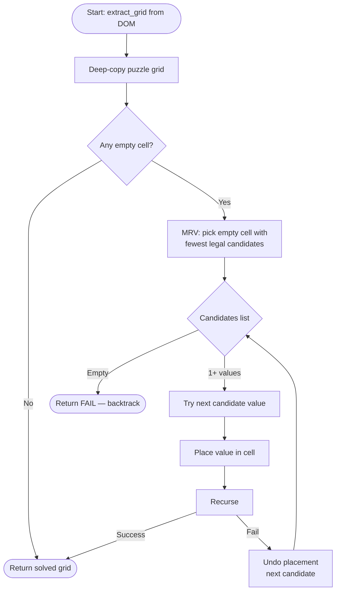
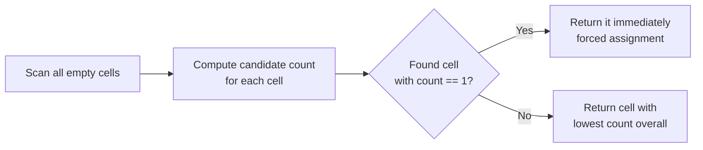
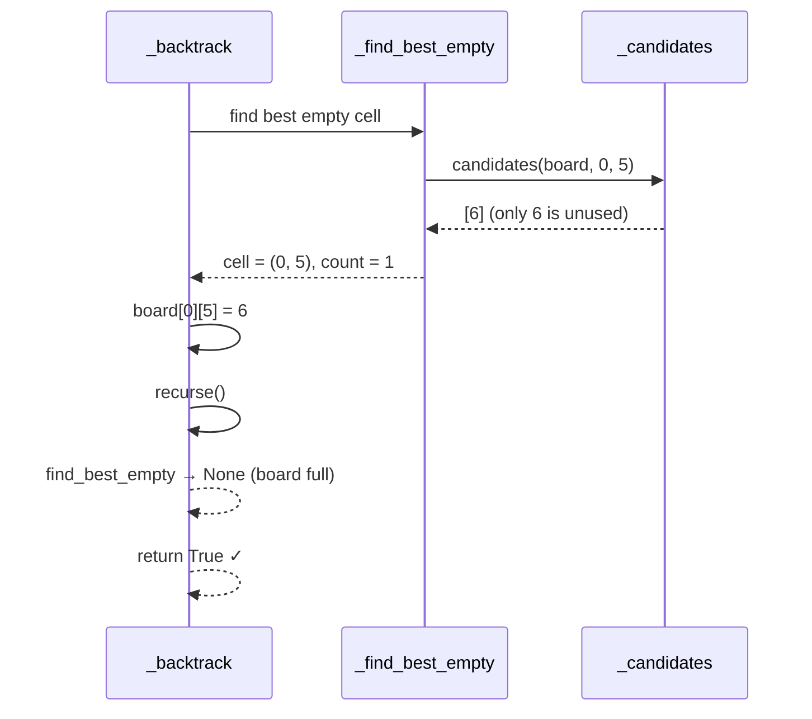

# Mini Sudoku — Algorithm

**Source:** `linkedin_games/sudoku/solver.py`

## Approach: Backtracking + MRV

The solver uses **recursive backtracking** with the **Minimum Remaining Values (MRV)** heuristic. It is a complete algorithm — if a solution exists it will always find it; if not, it correctly returns `None`.

---

## Constraint model

| Component | Description |
|-----------|-------------|
| Variables | Each empty cell in the 6×6 grid |
| Domain | {1, 2, 3, 4, 5, 6} |
| Row constraint | No number repeats within a row |
| Column constraint | No number repeats within a column |
| Box constraint | No number repeats within a 2×3 sub-grid |

---

## High-level flow



---

## MRV heuristic in detail

Without MRV, backtracking picks cells in row-major order (top-left → bottom-right). This is inefficient because a heavily-constrained cell deep in the grid might be discovered only after many placements have been made, causing expensive backtracking.

MRV instead selects the cell with the **smallest candidate set** at every step:



!!! tip "Why this is powerful"
    A cell with one candidate is a **forced assignment** — no branching occurs.
    Choosing it first propagates constraint information before exploring any
    alternatives, collapsing large parts of the search space instantly.

---

## Candidate computation

For cell `(row, col)`, the set of valid numbers is computed by eliminating
values already used in the same row, column, and 2×3 box:

```mermaid
flowchart TD
    A["Cell (row, col)"] --> B[Collect used values\nfrom row]
    A --> C[Collect used values\nfrom column]
    A --> D[Compute box origin:\nbox_r = row//2 × 2\nbox_c = col//3 × 3]
    D --> E[Collect used values\nfrom 2×3 box]
    B & C & E --> F[used = row ∪ col ∪ box]
    F --> G["candidates = {1..6} − used"]
    G --> H[Return sorted candidates]
```



```python
def _candidates(board, row, col):
    used = set(board[row])                         # row
    used |= {board[r][col] for r in range(6)}      # column
    box_r = (row // 2) * 2
    box_c = (col // 3) * 3
    for r in range(box_r, box_r + 2):
        for c in range(box_c, box_c + 3):
            used.add(board[r][c])                  # 2×3 box
    return sorted({1, 2, 3, 4, 5, 6} - used)
```

---

## Full backtracking trace (small example)

Consider a 6×6 grid where only cell `(0, 5)` is empty and the row already
contains 1, 2, 3, 4, 5:



---

## Worked example: harder puzzle

```
Input:           After MRV picks (0,5):   Solution:
· · 3 · · ·      · · 3 · · 5             1 2 3 4 6 5
· · · · 5 ·  →   · · · · 5 ·        →   4 6 2 3 5 1
· 5 · · · 1      ...                     2 5 1 6 4 3
2 · · · 4 ·                              3 1 5 2 4 6  ← wait
· 4 · · · ·                              6 4 2 5 1 3
· · · 6 · ·                              5 3 6 1 2 4
```

The MRV heuristic ensures that cells with only one valid choice (forced by row
+ column + box) are always resolved first, keeping the branch factor near 1
for most of the solve.

---

## Complexity

| Measure | Value |
|---------|-------|
| Worst-case time | O(6^m) where m = number of empty cells |
| Typical time | Sub-millisecond (MRV collapses most branches) |
| Space | O(m) call-stack depth |
| Grid size | 6×6 = 36 cells, ~20 typically empty |

---

## Sub-grid layout reference

```
┌─────────────┬─────────────┐
│  Box 0      │  Box 1      │
│  rows 0-1   │  rows 0-1   │
│  cols 0-2   │  cols 3-5   │
├─────────────┼─────────────┤
│  Box 2      │  Box 3      │
│  rows 2-3   │  rows 2-3   │
│  cols 0-2   │  cols 3-5   │
├─────────────┼─────────────┤
│  Box 4      │  Box 5      │
│  rows 4-5   │  rows 4-5   │
│  cols 0-2   │  cols 3-5   │
└─────────────┴─────────────┘
```
