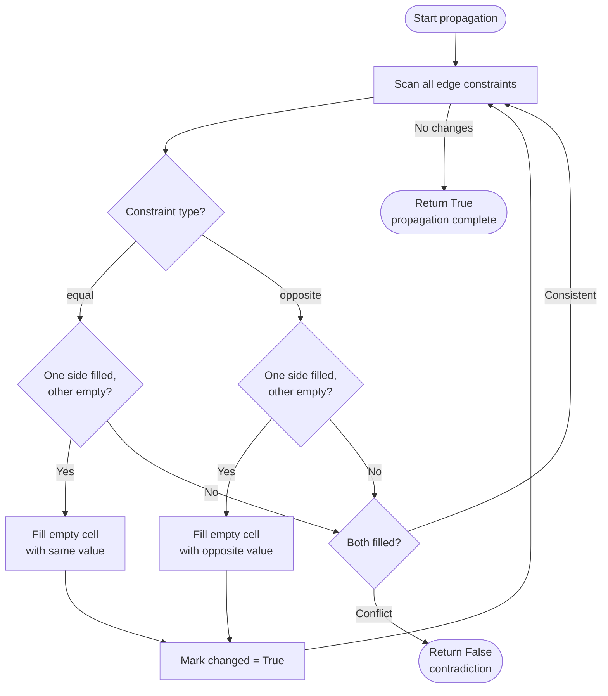
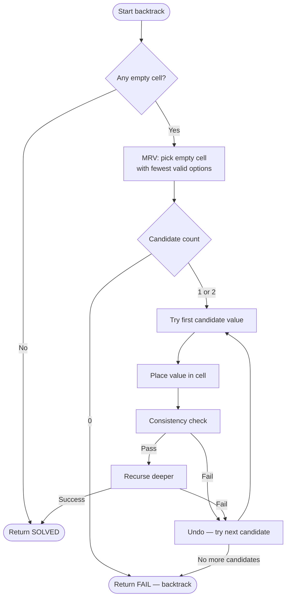
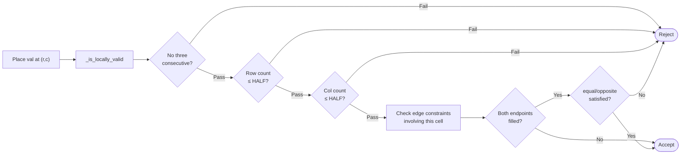
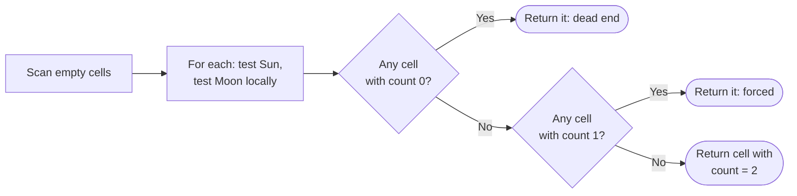
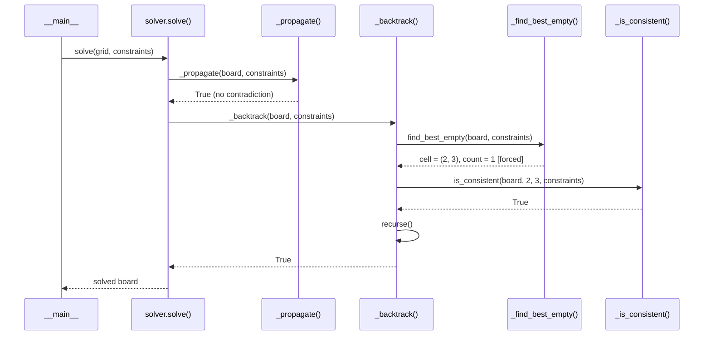

# Tango — Algorithm

**Source:** `linkedin_games/tango/solver.py`

## Approach: Constraint Propagation + Backtracking + MRV

The solver combines three techniques in a specific order to minimise search:

1. **Constraint propagation** — derive forced assignments from edge constraints before searching.
2. **Backtracking with MRV** — explore remaining cells using the variable with the fewest legal options.
3. **Consistency checking** — prune branches as early as possible using local validity rules.

---

## Constraint model

| Component | Description |
|-----------|-------------|
| Variables | Each empty cell in the 6×6 grid |
| Domain | {Sun = 1, Moon = 2} |
| Balance rule | Exactly 3 Suns and 3 Moons per row and column |
| No-three rule | No 3 consecutive identical symbols horizontally or vertically |
| Edge constraints | `equal` (same symbol) or `opposite` (different symbol) between adjacent cells |

---

## Phase 1: Constraint Propagation

Before any backtracking, the solver scans all edge constraints and applies **arc consistency**. If one endpoint of a constraint is already filled and the other is empty, the second cell can be immediately determined:



This loop repeats (fixed-point iteration) until no new deductions can be made or a contradiction is found.

!!! note "Why propagation before backtracking?"
    Many LinkedIn Tango puzzles can be fully solved by propagation alone —
    especially those with chains of `equal`/`opposite` constraints. When
    propagation leaves 0 undecided cells, backtracking is never invoked at all.

### Propagation example

```
Given:  (0,0) = ☀,  constraint: (0,0) = (0,1)

Step 1: (0,1) is empty, (0,0) = ☀, type = equal  →  (0,1) := ☀
Step 2: constraint: (0,1) × (0,2)
        (0,1) = ☀, type = opposite                →  (0,2) := ☽
Step 3: No more deductions. Stop.
```

---

## Phase 2: Backtracking with MRV

After propagation, remaining empty cells are filled via backtracking:



---

## Consistency check in detail

After placing a value at `(r, c)`, two checks run before recursing:



### No-three-in-a-row check

Six patterns are tested for each placed cell — three horizontal and three vertical:

```
Horizontal patterns for cell at column c:
  [c-2][c-1][c]   ←←←
  [c-1][c][c+1]   ←→
      [c][c+1][c+2]  →→

Vertical patterns for cell at row r: (same, transposed)
```

### Balance check

```
row_count  = number of val already in row  r
col_count  = number of val already in col  c

if row_count > 3 or col_count > 3:  REJECT
```

---

## MRV for binary domains

With only two possible values (Sun / Moon), MRV picks from:
- **Count = 0** → dead end, backtrack immediately.
- **Count = 1** → forced assignment, no branching.
- **Count = 2** → genuine choice, branch.



---

## End-to-end sequence diagram



---

## Complexity

| Measure | Value |
|---------|-------|
| After propagation | Often 0–5 undecided cells remain |
| Worst-case search | O(2^k) where k = undecided cells after propagation |
| Typical time | Sub-millisecond |
| Binary domain | Makes MRV very effective — forced assignments are common |
